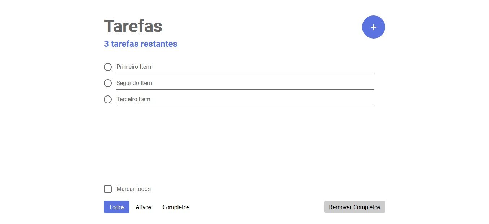

# Svelte To-Do App

<div style="width: 100%">
    
</div>

## :bulb: Sobre

Esse é meu primeiro app desenvolvido com o Svelte, desenvolvido objetivando os estudos da tecnologia junto com JavaScript e CSS. A ideia e tutoriais de introdução a linguagem vieram de [dev.to/simonholdorf](https://dev.to/simonholdorf/9-projects-you-can-do-to-become-a-frontend-master-in-2020-n2h) e [svelte.dev](https://svelte.dev/).

*Observação*: A imagem de background foi obtida da [Pexels](https://www.pexels.com/).

## :gear: Tecnologias

- HTML
- CSS
- JavaScript / Svelte

## :hammer: Ferramentas

- [Visual Studio Code](https://code.visualstudio.com/download)

## :book: Coisas aprendidas

- Criar apps com o Svelte, executar o servidor de desenvolvimento, compilar a versão de produção.

- Algumas técnicas de JavaScript desconhecidas para lidar, de melhor forma, com os *arrays*.

## :computer: Executando o projeto

### 1 - Clonar o repositório

```bash
git clone https://github.com/EduardoJM/svelte-to-do-app.git
cd svelte-to-do-app
```

### 2 - Instalar as dependências

```bash
npm install
```

### 3 - Executar o servidor de desenvolvimento

```bash
npm run dev
```

### 4 - Compilar versão de produção

```bash
npm run build
```

## :bookmark_tabs: Coisas a Fazer

- TODO: Reestruturar o código de marcação e refazer os estilos para melhor experiência de usuário e mais elegância.

- TODO: Melhorar a exibição para celulares.

- TODO: Adicionar pré-visualização online.

## :nerd_face: Autor

Desenvolvido por [Eduardo Oliveira](https://github.com/eduardojm/).